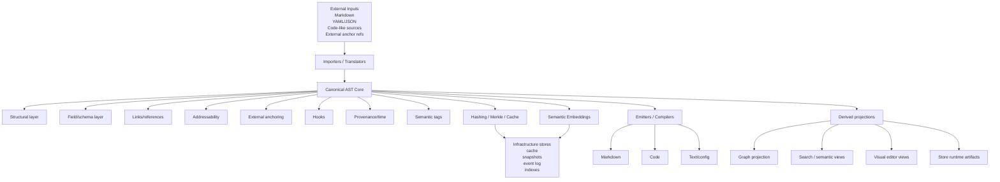

# Feature: Canonical AST design — current state of the target model

## Kind

feature

## Status

open

## Purpose

This document consolidates what we currently mean by the future SLDB canonical AST.

It is not the final schema.

It is the most explicit summary of the design accumulated so far, including:

- what the AST must represent
- which layers belong inside the AST model
- which layers belong beside it as infrastructure
- how projections and importers relate to it
- where hashes and semantic embeddings fit

## Core idea

The canonical AST is the main internal representation of SLDB.

It must be rich enough to represent documents and their operational semantics directly.

Markdown is no longer sovereign.

Pydantic-style field contracts do not disappear, but they become one dimension of the canonical model rather than the only structuring principle.

The AST must support both:

- current SLDB-style document/model workflows
- future visual editing, graph navigation, anchoring, and richer projections

## Main architectural role of the AST

The AST is the shared canonical substrate for:

- CLI workflows
- future visual UX/editor workflows
- importers
- compilers/emitters
- store/cache infrastructure
- graph/semantic projections
- links and anchoring
- field-aware validation and rendering

## What belongs inside the AST model

The AST must carry at least these dimensions.

### 1. Structural layer

This is the basic document/tree structure.

It includes:

- `node_id`
- `document_id`
- `parent_id`
- sibling order
- node kind
- node subtype
- children
- slots / named regions
- textual content
- typed content payloads
- generic attributes / properties
- source spans / origin spans

This is the minimum needed for a real tree-shaped canonical document model.

### 2. Field and schema layer

This preserves the original SLDB idea that documents bind to typed fields and model contracts.

It includes:

- `field_id`
- `field_name`
- `field_path`
- schema/model binding
- expected type
- nested type / item type
- cardinality
- required/optional
- default
- validation constraints
- extraction strategy metadata
- render strategy metadata
- reversibility metadata
- derived vs authored state
- composition metadata

This lets one or more AST nodes bind to typed fields without forcing the field model to define the whole canonical structure.

### 3. Link and reference layer

Links should become typed relations on canonical nodes, not ad hoc string behavior.

It includes:

- outgoing links
- incoming/backlink projections
- transclusions
- typed references
- internal targets
- external targets
- resolution state
- link provenance
- link semantics / predicate information

### 4. Addressability layer

The AST must support stable addressing of meaningful units.

It includes:

- structural path
- local anchor ids
- fragment ids
- aliases
- stable selectors
- canonical vs derived addresses

This is what makes sections, fields, blocks, and future finer-grained units queryable and targetable.

### 5. External anchoring layer

The AST must support anchoring that points outside the local document when needed.

It includes:

- external resource reference
- locator / selector
- text sample
- context-before / context-after
- content fingerprint / hash
- reattachment policy
- anchoring evidence
- confidence metadata

This is necessary for integration with external anchored content and richer reference workflows.

### 6. Hook layer

The AST must be able to describe hooks declaratively even if execution happens elsewhere.

It includes:

- hook id
- hook kind
- executable target
- expected inputs
- expected outputs
- execution policy
- verification/result contract
- binding to nodes or fields

### 7. Provenance and temporal layer

The AST-centered runtime must know more than file history.

It includes:

- authored vs derived state
- source of import
- transformation lineage
- `created_at`
- `updated_at`
- `valid_from`
- `valid_to`
- version / revision id
- event lineage
- evidence metadata

This is the beginning of append-only and reconstructable history beyond git.

### 8. Semantic layer

The AST should carry a semantic dimension directly, not only as a late export artifact.

It includes:

- semantic tags
- semantic role/classification
- equivalence hints
- concept bindings
- semantic references
- semantic query hints

### 9. Hashing and fingerprint layer

The AST or AST-adjacent core model must support structural hashing.

It includes:

- node hash
- subtree hash
- dependency hash
- materialization hash
- structural fingerprint
- dirty-state / invalidation metadata

These hashes support:

- Merkle behavior
- cache invalidation
- incremental compilation
- deduplication
- integrity checking

### 10. Semantic embedding layer

In addition to hashes, the AST should support semantic embeddings as a first-class optional dimension.

This should not replace explicit structure.

It should complement it.

Possible embedding-bearing units include:

- whole documents
- sections
- paragraphs
- fields
- link neighborhoods
- anchor contexts
- semantic aggregates

Embedding metadata may include:

- embedding id
- model/provider name
- embedding vector or external vector reference
- embedding scope
- generation timestamp
- source text span or source node set
- version of the embedding recipe
- confidence / freshness metadata

Why embeddings matter here:

- semantic search
- fuzzy retrieval
- related-node discovery
- graph enrichment
- anchor reattachment assistance
- template/model recommendation
- editor UX assistance

Important constraint:

- embeddings are auxiliary semantic materializations
- they must not become the canonical structure
- explicit node/field/link semantics remain primary

### 11. Semantic indexing placeholders

We should leave explicit placeholders in the model and architecture for richer semantic indexing that will be filled later.

This includes future integration paths such as proposition-oriented or logic-oriented semantic engines.

For now, these remain placeholders by design.

They are not fully specified yet.

Likely placeholder areas include:

- node-level semantic claim slots
- field-level semantic claim slots
- proposition extraction hooks
- context/world bindings
- relation typing placeholders
- semantic neighborhood projections
- matrix-style projection metadata
- semantic index recipe/version metadata

These placeholders exist so the AST and surrounding infrastructure do not close the door on a future semantic engine integration.

A likely future fill path is:

- AST nodes/fields/links -> semantic facts/propositions -> external semantic engine or matrix runtime

This document intentionally does not finalize that mapping yet.

## What should stay outside the AST proper

The AST must be the center, but not everything belongs directly inside every node.

Some things should live beside it as infrastructure or derived projections.

### Infrastructure beside the AST

- append-only event log
- snapshots
- cache storage
- Merkle index persistence
- dependency graph indexes
- projection registries
- embedding stores when vectors are too large to inline

### Derived projections

- Markdown materialization
- code generation outputs
- graph exports
- semantic indexes
- search indexes
- store runtime artifacts
- visual editor projections

## Extensibility principle for the AST and Rust core

The AST design should aim to be as extensible as possible.

That does not mean making every node shapeless.

It means designing:

- a small stable core
- typed extensibility points
- optional capability layers
- graph-friendly internal operations
- room for future node/edge families without rewriting the core

The practical extensibility target is not only the AST schema.

It is also the Rust implementation.

The Rust core should be designed so that new node types, edge kinds, semantic layers, anchoring modes, projection adapters, and indexing strategies can be added without collapsing the base model.

A useful implementation direction is to consider graph-oriented internal tooling such as `petgraph`.

Why this matters:

- the canonical structure is tree-like at its center but not tree-only in operation
- links, transclusions, anchors, semantic relations, provenance, dependency edges, and projection relations all introduce graph behavior
- future editor/runtime features will likely need both tree navigation and graph traversal

So the internal model should assume:

- a canonical tree spine for document ownership and ordering
- graph-capable side relations for non-tree structure

This suggests a Rust design where:

- nodes remain the canonical owned units
- parent/child edges preserve structural document order
- additional typed edges capture links, anchors, semantic relations, provenance dependencies, and projection dependencies
- tree and graph operations can coexist cleanly

## Text-as-graph placeholder

A later integration target is that the text itself may also be represented as a graph.

This is important in light of the `marcado` direction.

`marcado` is already exploring a Semantic Markdown ASG style approach with:

- milestone markers
- canonical ASG JSON
- stable anchor lookup
- graph validation
- repository-backed remote anchors

So the AST design should not assume that textual content is forever only a flat string payload inside nodes.

We should leave explicit room for future text-graph representations, where:

- textual spans can become addressable graph units
- rhetorical or semantic anchor points can be graph nodes
- local text structure can be navigated beyond plain block hierarchy
- anchors can bind to graph-backed textual evidence

For now this remains a forward-looking placeholder.

We do not need to force the first AST version to fully internalize text as graph.

But we should avoid designing the Rust core in a way that blocks that future.

## AST field model: base vs optional layers

The AST should not become a huge flat record where every node carries every possible field.

A better shape is:

- small required core node schema
- optional typed capability layers
- external sidecars / indexes for heavy derived data

Suggested split:

### Required core node data

- ids
- type/kind
- content/attrs
- tree relationships
- addressability essentials

### Optional attached capability data

- field bindings
- links
- anchors
- hooks
- provenance
- semantic tags
- hashes
- embedding references

### External sidecars / indices

- full embedding vectors
- dense graph indexes
- cache artifacts
- render snapshots
- historical event stores

## Current conceptual flow

1. Input arrives.
   - Markdown
   - YAML/JSON
   - future code-oriented inputs
   - external anchor references

2. Importers translate the input into canonical AST nodes.

3. AST nodes receive or bind:
   - field/schema metadata
   - links
   - anchors
   - hooks
   - semantic tags
   - provenance

4. Infrastructure computes:
   - hashes
   - subtree Merkle structure
   - dependency indexes
   - embeddings
   - cache entries
   - historical records

5. Projections emit:
   - Markdown
   - code
   - graph views
   - search views
   - visual editor models
   - runtime/store artifacts

## Diagram

## Relationship with ProseMirror and tree-sitter

Neither ProseMirror nor tree-sitter should be the canonical AST.

They are downstream adapters or projection-oriented representations.

### ProseMirror fits as

- editing projection
- structured visual document model
- local transform-aware view
- future visual UX substrate

### tree-sitter fits as

- syntax parser substrate
- code-oriented importer/projection helper
- language-aware code surface companion

## Current non-goals

At this stage, this design does not yet define:

- the exact Rust schema
- the final serialization format
- the final append-only storage engine
- the final embedding backend
- the full visual editor implementation

This document only captures what the AST must be able to hold conceptually.

## Current open questions

- What is the minimum viable node schema for AST v1?
- Which capability layers must ship in the first slice, and which can remain sidecars initially?
- Should embeddings be inline references only, or allowed inline values for small scopes?
- Which current SLDB runtime concepts map directly to AST nodes versus AST-side infrastructure?
- What is the first safe vertical slice?
  - likely `Markdown -> AST -> Markdown`
  - with hashes early
  - embeddings later or optional
