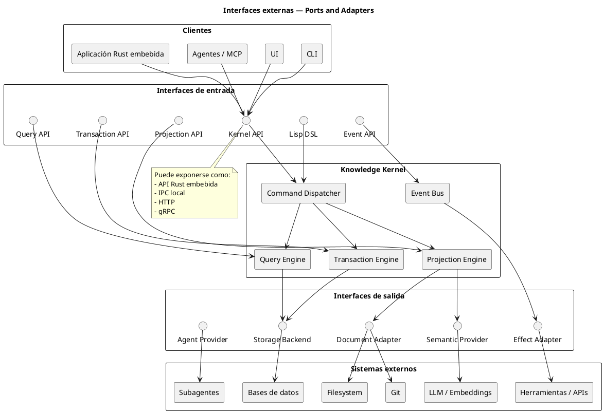
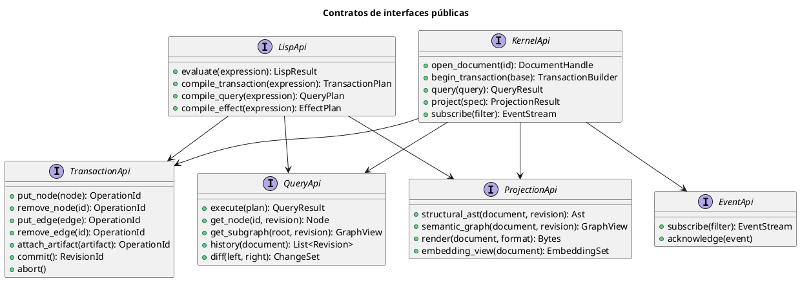
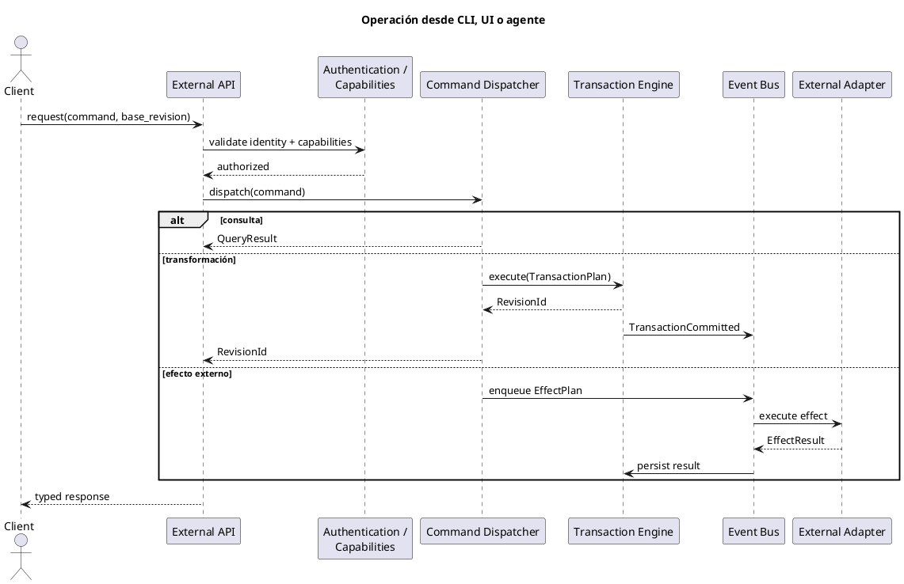

Había interfaces externas dispersas en los diagramas anteriores, pero falta un **diagrama explícito de puertos y adaptadores**.

## 1. Interfaces externas del kernel

---

## 2. Contratos públicos del kernel

---

## 3. Adaptadores externos

```plantuml
@startuml
title Interfaces de integración externa

interface DocumentSource {
    +identify(): SourceIdentity
    +metadata(): SourceMetadata
    +read(range): Bytes
    +write(content, expected_version): SourceVersion
}

interface Parser {
    +supports(media_type): bool
    +parse(bytes): SyntaxTree
}

interface Renderer {
    +supports(document_type, format): bool
    +render(ast): Bytes
}

interface StorageBackend {
    +append_transaction(tx): TransactionId
    +put_revision(revision)
    +get_revision(id): Revision
    +put_content(hash, bytes)
    +get_content(hash): Bytes
    +compare_and_swap_head(document, expected, next): bool
}

interface SemanticProvider {
    +embed(request): EmbeddingResult
    +classify(request): SemanticResult
}

interface EffectExecutor {
    +validate(plan): CapabilityRequest
    +execute(effect): EffectResult
}

interface AgentProvider {
    +invoke(agent, context): AgentResult
}

class FilesystemSource
class GitSource
class HttpSource
class TreeSitterParser
class MarkdownRenderer
class RedbBackend
class CozoBackend
class EmbeddingService
class WasmEffectExecutor
class LocalAgentAdapter
class McpAgentAdapter

DocumentSource <|.. FilesystemSource
DocumentSource <|.. GitSource
DocumentSource <|.. HttpSource

Parser <|.. TreeSitterParser
Renderer <|.. MarkdownRenderer

StorageBackend <|.. RedbBackend
StorageBackend <|.. CozoBackend

SemanticProvider <|.. EmbeddingService
EffectExecutor <|.. WasmEffectExecutor

AgentProvider <|.. LocalAgentAdapter
AgentProvider <|.. McpAgentAdapter

@enduml
```

---

## 4. Flujo desde una interfaz externa

## Interfaces externas principales

| Dirección | Interfaz           | Ejemplos                      |
| --------- | ------------------ | ----------------------------- |
| Entrada   | API Rust           | Kernel embebido               |
| Entrada   | Lisp DSL           | REPL, macros, agentes         |
| Entrada   | HTTP/gRPC/IPC      | CLI, UI, procesos externos    |
| Entrada   | eventos            | filesystem, Git, herramientas |
| Salida    | `DocumentSource`   | archivos, Git, HTTP           |
| Salida    | `StorageBackend`   | redb, CozoDB                  |
| Salida    | `SemanticProvider` | embeddings, LLM               |
| Salida    | `EffectExecutor`   | Git, shell, APIs              |
| Salida    | `AgentProvider`    | subagentes, MCP               |

La idea central es que el kernel solo conozca **traits propios**. Tree-sitter, Steel, CozoDB, Wasmtime, Git o proveedores de modelos quedan detrás de adaptadores reemplazables.

