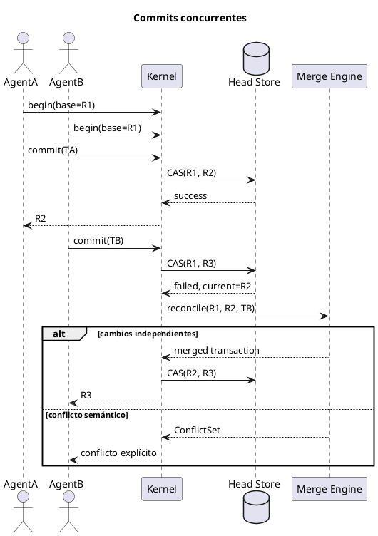

Sí. Los UML ya cubren bastante bien **qué componentes existen**, pero falta documentar **por qué están separados así** y las invariantes que no se pueden romper.

# Razonamiento de la arquitectura

## 1. El modelo canónico es la fuente de verdad

El núcleo no guarda Markdown, Lisp ni árboles de Tree-sitter como representación principal.

Guarda un grafo canónico compuesto por:

```text
Node
Edge
Document
Revision
Transaction
Artifact
```

Esto evita que el sistema quede atado a:

* un formato textual;
* una gramática;
* una interfaz;
* una biblioteca específica;
* un lenguaje de programación.

Markdown, código, CLI, UI y Lisp son entradas o proyecciones del mismo modelo.

---

## 2. Lisp es metalenguaje, no autoridad

Lisp sirve para:

* consultas;
* macros;
* transformaciones;
* reglas;
* hooks;
* composición de operaciones.

Pero debe compilar a tres tipos de planes:

```text
TransactionPlan
QueryPlan
EffectPlan
```

El kernel valida esos planes antes de ejecutarlos.

Esto permite extensibilidad sin entregar a las macros acceso arbitrario a la persistencia.

---

## 3. Clojure protege las invariantes

Clojure queda encargado de:

* identidad estable;
* tipos;
* permisos;
* transacciones;
* canonicalización;
* hashing;
* control de concurrencia;
* persistencia;
* validación de operaciones.

La división conceptual sería:

```text
Lisp expresa intención.
Clojure decide si esa intención es válida.
```

---

## 4. El grafo tiene distintas semánticas

No todas las aristas deben comportarse igual:

| Arista      | Uso                                |
| ----------- | ---------------------------------- |
| `Ownership` | estructura del documento           |
| `Reference` | anclajes entre documentos          |
| `Semantic`  | relaciones de significado          |
| `Derived`   | embeddings, inferencias y análisis |

Solo `Ownership` debería participar directamente en el Merkle estructural. De otro modo, una referencia circular podría volver imposible calcular el hash.

---

## 5. El log es inmutable; los índices no

La fuente de verdad sería:

```text
Transaction log
+ Content-addressed store
+ Revisions
+ Document heads
```

Todo lo demás es reconstruible:

```text
Petgraph
Índices
Embeddings
Caches
Proyecciones
Hechos lógicos derivados
```

Por eso Petgraph puede acelerar consultas, pero no debería ser la base persistente.

---

## 6. Las proyecciones son datos derivados

Una AST semántica, una interfaz web o un embedding no deben modificar el documento original.

Conceptualmente:

```text
Revision + ProjectionSpec + EngineVersion
                    ↓
             ProjectionResult
```

Esto permite:

* recalcular resultados;
* comparar motores;
* actualizar renderizadores;
* invalidar solo lo necesario;
* conservar provenance.

---

## 7. Los efectos ocurren fuera de la transacción

Git, APIs, filesystem, herramientas y subagentes pueden fallar o tardar.

Por eso:

```text
Transacción
    ↓
EffectPlan
    ↓
Outbox persistente
    ↓
Ejecución externa
    ↓
EffectResult
    ↓
Nueva transacción
```

Así una llamada externa nunca deja el grafo parcialmente modificado.

---

## 8. El Merkle es perezoso

No hace falta observar ni hashear permanentemente todos los archivos.

Cuando un nodo cambia:

1. Se marca su rama como sucia.
2. Se invalidan los hashes de sus ancestros.
3. El hash se recalcula solo al consultar, comparar, exportar o confirmar una revisión.

Esto combina integridad con bajo costo operativo.

# Invariantes que conviene escribir formalmente

Estas deberían aparecer en la documentación del kernel:

```text
1. Ninguna revisión existente puede modificarse.
2. Toda mutación produce una nueva revisión.
3. Toda revisión apunta a una transacción válida.
4. Los NodeId son estables entre revisiones cuando la identidad se conserva.
5. Toda operación externa requiere capabilities explícitas.
6. Un efecto externo nunca muta directamente el grafo.
7. Los datos derivados pueden reconstruirse desde las fuentes de verdad.
8. La canonicalización debe ser determinista.
9. parse(render(canonical_ast)) debe producir el mismo canonical_ast.
10. El mismo contenido canónico debe generar el mismo hash.
```

# Diagramas que todavía agregaría

| Diagrama                        | Para qué sirve                              |
| ------------------------------- | ------------------------------------------- |
| Commit concurrente y conflictos | Define optimistic concurrency y merges      |
| Recuperación después de crash   | Garantiza atomicidad del commit             |
| Evolución de esquemas           | Cambios de tipos, nodos y operaciones       |
| Capabilities y seguridad        | Permisos de Lisp, hooks, agentes y plugins  |
| Provenance completo             | Origen de nodos, inferencias y proyecciones |
| Ciclo de vida de plugins        | Instalación, versión, aislamiento y retiro  |
| Invalidación de caches          | Qué se recalcula al modificar un nodo       |
| Merge entre revisiones          | Cambios internos frente a cambios externos  |

## El más importante que falta: concurrencia



En resumen, la arquitectura busca mantener tres propiedades simultáneamente:

> **Un núcleo pequeño y verificable en Clojure, una superficie infinitamente extensible en Lisp y un historial completamente reproducible e inmutable.**

